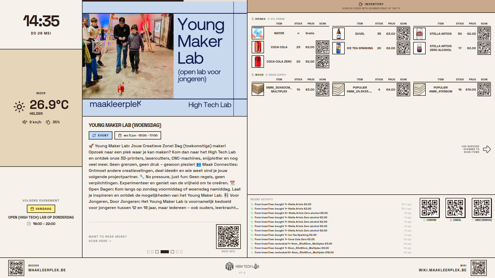

# Tv-Presentation

Full-screen TV display for [maakleerplek](https://maakleerplek.be/) — a public makerspace in Leuven. Shows the current time, weather, upcoming events, news, a drinks/materials inventory, and machine usage rates on a 4K TV.



## Layout

The screen is optimized for a 4K display and divided into three main columns:

```
┌─────────────┬──────────────────────┬──────────────────────┐
│ Clock       │                      │ Inventory (InvenTree)│
│ Weather     │   Event/News Carousel│                      │
│ Status      │                      ├──────────────────────┤
│             │                      │ Machine Usage (Wiki) │
├─────────────┴──────────────────────┴──────────────────────┤
│ Bezoek QR URL │      HTL Logo      │      Wiki QR URL     │
└────────────────────────────────────────────────────────────┘
```

- **Left:** Time, date, local weather, and currently running or next upcoming event.
- **Center:** A rotating carousel of upcoming workshops, recurring events, and recent news articles.
- **Right:** Live inventory from InvenTree (Drinks, Snacks & Materialen) and dynamic machine usage pricing scraped from the Wiki.
- **Footer:** Direct links to the website and the general Wiki page via QR codes.

## Features

### 🛠️ Dynamic Wiki Scraper
The data-fetcher service includes a resilient scraper that pulls live pricing and equipment data from the [High Tech Lab Wiki](https://wiki.maakleerplek.be/en/hightechlab).
- **Auto-detection:** Automatically identifies "Machine Gebruik" sections.
- **Resilient Parsing:** Handles standard tables, nested lists, and grid-style pricing (like MDF dimensions).
- **Caching:** Scraped data is cached along with calendar and news data to minimize load on the Wiki.

### 📦 InvenTree Integration
Pulls live stock levels and prices for drinks, snacks, and consumable materials directly from an InvenTree instance.

### 📅 Calendar & News
Scrapes the main maakleerplek.be website for the latest news and upcoming events, automatically prioritizing "high-profile" events like OpenLabs or Repair Cafés.

## Quick Start

```bash
# 1. Copy config
cp .env.example .env

# 2. Build and run
docker compose up --build
```

- Frontend: `http://localhost:8083`
- Data-fetcher API: `http://localhost:8085`

## Configuration

| Variable | Description |
|---|---|
| `MAAKLEERPLEK_URL` | Base URL of the website; also used for the "Bezoek" QR code |
| `WIKI_QR_URL` | URL encoded into the "Wiki" QR code in the footer |
| `WIKI_PRICING_URL` | The specific Wiki page to scrape machine usage from |
| `INVENTREE_URL` | URL of your InvenTree instance |
| `INVENTREE_TOKEN` | InvenTree API token |
| `INVENTREE_DRINKS_LOCATIONS` | Comma-separated location names to show in the inventory panel |
| `PAYMENT_QR_URL` | URL for the payment QR code shown in the inventory section |
| `CAROUSEL_TRANSITION_TIME` | Seconds per carousel slide (default `15`) |
| `EVENT_PRIORITY` | Comma-separated keywords; earlier = higher priority in the status panel |
| `WEATHER_LAT` / `WEATHER_LON` | Coordinates for Open-Meteo weather |
| `CACHE_DURATION_MINUTES` | How long scraped data is cached (default `15`) |

## Development

```bash
# Run docker compose
docker compose up --build 
# Frontend: http://localhost:8083
# Data-fetcher API: http://localhost:8085

## Tests

```bash
# Frontend
cd "Reworked website"
bun test

# Data-fetcher
cd data-fetcher
bun test
```

## Styling — Tailwind CSS v3 and TV compatibility

### Why Tailwind v3 (not v4)

The presentation runs on a **Samsung Smart TV (Tizen 6.5)** whose built-in browser is based on **Chrome 85** (August 2020). Tailwind CSS v4 generates CSS that Chrome 85 silently rejects entirely, breaking the whole layout:

| Tailwind v4 feature | Required Chrome version | Chrome 85 |
|---|---|---|
| `@layer` (cascade layers) | Chrome 99 | Not supported — **entire stylesheet dropped** |
| `@property` (custom property descriptors) | Chrome 85 | Supported, but paired with `@layer` |
| `oklch()` colour function | Chrome 111 | Not supported |

Because `@layer` is used at the top level of every Tailwind v4 stylesheet, the TV browser discards the whole CSS file on load, leaving only unstyled HTML. **Tailwind v3 does not use `@layer`, `@property`, or `oklch()`**, so it is fully compatible with Chrome 85.

### Tailwind v3 setup

There is no `tailwind.config.js` auto-detection in v4 style — configuration lives in `tailwind.config.js` at the root of `Reworked website/`:

```
Reworked website/
├── tailwind.config.js      # content paths + font variable wiring
├── postcss.config.mjs      # uses `tailwindcss` plugin (not @tailwindcss/postcss)
└── app/globals.css         # @tailwind base; @tailwind components; @tailwind utilities;
```

### CSS properties to avoid (Chrome 85 cutoffs)

When writing styles — whether in Tailwind utility classes or inline — avoid anything that requires a browser newer than Chrome 85:

| CSS feature | Tailwind class | Chrome support | Status |
|---|---|---|---|
| `inset` shorthand | `inset-*` | Chrome 87 | **Avoid** — use `top-0 right-0 bottom-0 left-0` |
| `aspect-ratio` | `aspect-*` | Chrome 88 | **Avoid** — use explicit `w-*` / `h-*` |
| `@layer` | — | Chrome 99 | **Avoid** in custom CSS |
| `gap` on flex | `gap-*` | Chrome 84 | OK |
| `object-fit` | `object-cover` etc. | Chrome 31 | OK |
| CSS Grid | `grid-cols-*` etc. | Chrome 57 | OK |

**The most common pitfall is `inset-0`** — it looks harmless but generates `inset: 0px`, which Chrome 85 silently drops. Always expand it to four separate directional utilities.

### next/image and `fill` prop

Next.js 13+ renders `<Image fill>` with the inline style `inset: 0px`, which Chrome 85 drops (same issue as above). Use a plain `` tag instead:

```tsx
// Avoid on Chrome 85 — generates inset: 0px inline style
<Image fill className="object-cover" src={url} alt="..." />

// Use this instead
// eslint-disable-next-line @next/next/no-img-element

```

`<Image>` with explicit `width` and `height` props (not `fill`) is fine — it does not generate `inset`.

## Tech Stack

- **Next.js 15** (App Router, TypeScript, Tailwind CSS v3)
- **Node.js + Express + Cheerio** — scrapes maakleerplek.be for events and news
- **InvenTree** — source for the drinks menu
- **Docker Compose** — runs both services together
